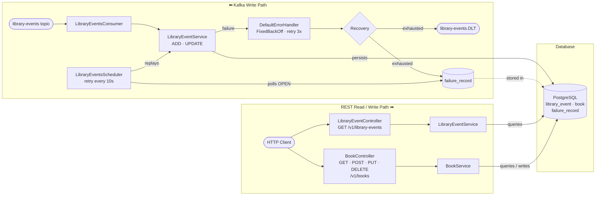

# Implementation Plan
## Library Events Consumer

## What We Are Building

A Spring Boot service that consumes library events from Kafka, persists them to PostgreSQL, and exposes the data over REST. The diagram below shows every component we will build and how they connect.

Two independent paths — one driven by Kafka, one by HTTP — sharing the same PostgreSQL database.



| Path | Trigger | Writes | Reads |
|---|---|---|---|
| **Kafka write** | Message on `library-events` | `library_event`, `book`, `failure_record` | — |
| **REST** | HTTP request | `book` only (via `BookController`) | `library_event`, `book` |


---

## Table of Contents

- [What We Are Building](#what-we-are-building)
- [1. Objective](#1-objective)
- [2. Planning Assumptions](#2-planning-assumptions)
- [3. Execution-Order Implementation Roadmap](#3-execution-order-implementation-roadmap)
    - [Step 1: Kafka Consumer + Configuration](#step-1-kafka-consumer--configuration--start-here)
    - [Step 2: DTO + Deserialization](#step-2-dto--deserialization)
    - [Step 3: Kafka Under the Hood](#step-3-kafka-under-the-hood)
    - [Step 4: StringDeserializer vs JsonDeserializer](#step-4-stringdeserializer-vs-jsondeserializer)
    - [Step 5: Consumer Groups and Consumer Offset Management](#step-5-consumer-groups-and-consumer-offset-management)
    - [Step 6: Tasks - Business Logic](#step-6-tasks---business-logic)
        - [Tasks — PostgreSQL Setup](#tasks--postgresql-setup)
        - [Tasks — Flyway Migration](#tasks--flyway-migration)
        - [Tasks — Entities and Repositories](#tasks--entities-and-repositories)
        - [Tasks — Business Logic](#tasks--business-logic)
        - [Tasks — Validation](#tasks--validation)
    - [Step 7: Integration Test to Ensure Save is Working](#step-7-integration-test-to-ensure-save-is-working)
- [4. Testing Strategy](#4-testing-strategy)
    - [4.1 Unit Tests](#41-unit-tests)
    - [4.2 Integration Tests](#42-integration-tests)
    - [4.3 Repository Tests](#43-repository-tests)
    - [4.4 Minimum Acceptance Test Matrix](#44-minimum-acceptance-test-matrix)
- [5. Execution Sequence Summary](#5-execution-sequence-summary)
- [6. Definition of Done](#6-definition-of-done)
- [7. Helper Commands](#7-helper-commands)
    - [Recreate the library-events Kafka Topic](#recreate-the-library-events-kafka-topic)

---

## 1. Objective
Implement a Kafka consumer for topic `library-events` that:
- Inserts `LibraryEvent` + `Book` for `ADD`
- Updates existing `LibraryEvent` for `UPDATE`
- Handles validation, retry, and failure routing based on `docs/KAFKA_ERROR_HANDLING.md`

## 2. Planning Assumptions
- Input messages are JSON payloads with `eventType`, `libraryEventId` (for `UPDATE`), and `book`.
- PostgreSQL is the persistence store.
- Spring Kafka + Spring Data JPA are used.
- Error handling strategy is defined in `docs/KAFKA_ERROR_HANDLING.md` (retry + DLT + recovery modes).

## 3. Execution-Order Implementation Roadmap

> **Guiding principle:** Build the consumer-first pipeline incrementally — get messages
> flowing, then deserialize them, then persist, then add business rules. Each step
> produces a runnable, testable application.

### Step 1: Kafka Consumer + Configuration ✦ START HERE
Path: `src/main/java/com/learnkafka/consumer`, `src/main/java/com/learnkafka/config`, `src/main/resources/application.yml`

#### Goal
Stand up a working Kafka listener that reads raw messages from `library-events` and logs them. No deserialization, no DB — just prove connectivity.

#### Modules
- `LibraryEventsConsumer`
- `LibraryEventsConsumerConfig` (basic factory only)
- Kafka consumer properties in `application.yml`

#### Tasks
1. Configure Kafka consumer properties in `application.yml`:
    - `spring.kafka.consumer.bootstrap-servers`
    - `spring.kafka.consumer.group-id=library-events-listener-group`
    - `spring.kafka.consumer.key-deserializer=org.apache.kafka.common.serialization.IntegerDeserializer`
    - `spring.kafka.consumer.value-deserializer=org.apache.kafka.common.serialization.StringDeserializer`
    - `spring.kafka.consumer.auto-offset-reset=latest`
2. Create `LibraryEventsConsumerConfig` with a `ConcurrentKafkaListenerContainerFactory` bean (default error handler for now).
3. Create `LibraryEventsConsumer` class annotated with `@Component`.
4. Add `@KafkaListener(topics = "library-events")` method.
5. Accept message as `ConsumerRecord<Integer, String>`.
6. Log full Kafka metadata: topic, partition, offset, key, value.
7. **No service delegation yet** — the listener just logs the raw payload.

#### Deliverables
- A running consumer that connects to Kafka and logs every message from `library-events`.
- Kafka consumer properties externalized.
- Basic container factory configuration.

#### Acceptance Criteria
- Application starts without errors and joins the consumer group.
- Publishing a test message to `library-events` produces a log line with topic, partition, offset, key, and value.
- No DB or DTO code is required at this stage.

---

### Step 2: DTO + Deserialization
Path: `src/main/java/com/learnkafka/dto`

#### Goal
Deserialize the raw JSON string received in Step 1 into typed DTO objects. Validate structure. No persistence yet.

#### Modules
- `LibraryEventDto` (Java record)
- `BookDto` (Java record)

#### Tasks
1. Create `BookDto` record with fields: `bookId` (Integer), `bookName` (String), `bookAuthor` (String).
2. Create `LibraryEventDto` record with fields: `libraryEventId` (Integer), `eventType` (EventType — reuse existing enum from domain), `book` (BookDto).
3. Keep DTOs free of JPA annotations — strict separation from persistence model.
4. Add basic bean validation annotations on DTOs (lightweight, not full business rules):
    - `@NotNull` on `eventType` and `book` in `LibraryEventDto`.
    - `@NotBlank` on `bookName`, `bookAuthor` in `BookDto`.
    - `@NotNull` on `bookId` in `BookDto`.
5. Create a stub `LibraryEventService` with method `processEvent(ConsumerRecord<Integer, String>)` that:
    - Deserializes JSON value to `LibraryEventDto` using `ObjectMapper`.
    - Logs the deserialized DTO.
    - Does **not** persist anything yet.
6. Update `LibraryEventsConsumer` to delegate to `LibraryEventService.processEvent()`.

#### Deliverables
- Typed DTO records that deserialize from Kafka JSON payloads.
- Consumer now delegates to service; service deserializes and logs.
- Bean validation annotations ready for later enforcement.

#### Acceptance Criteria
- Sending a valid JSON message to `library-events` produces a log line showing the deserialized `LibraryEventDto`.
- Malformed JSON causes a `JsonProcessingException` (logged, not swallowed).
- DTOs have no JPA dependency.

---

### Step 3: Kafka Under the Hood
Path: `docs/3_Kafka_Consumer_Under_the_hood.md`, `src/main/java/com/learnkafka/consumer`, `src/main/java/com/learnkafka/config`

#### Goal
Understand how the Spring Kafka consumer works under the hood before adding advanced behavior.

#### Modules
- Kafka poll loop lifecycle
- Listener container threading and partition assignment
- Rebalance flow and record processing guarantees
- Manual acknowledgment behavior in this project

#### Tasks
1. Study `docs/3_Kafka_Consumer_Under_the_hood.md` and map concepts to current code.
2. Trace how `@KafkaListener` receives records and how container threads are created.
3. Trace record flow from poll loop to listener invocation and exception propagation.
4. Identify integration points for acknowledgment/error handling to be formalized in Step 5 and Step 6.
5. Identify hook points for retry/error handling to be implemented in Step 6.

#### Deliverables
- Clear mental model of consumer lifecycle: poll -> dispatch -> process -> error handling.
- Project-specific notes linking Kafka internals to `LibraryEventsConsumer` and config.

#### Acceptance Criteria
- Team can explain partition assignment, rebalance impact, and listener dispatch semantics in this codebase.
- Ownership of manual acknowledgment/commit verification is deferred to Step 5.

---

### Step 4: StringDeserializer vs JsonDeserializer
Path: `docs/4_STRING_VS_JSON_DESERIALIZER.md`, `src/main/resources/application.yml`, `src/test/resources/application.yml`

#### Goal
Decide and implement the right deserializer strategy for this consumer (`JsonDeserializer` with DTO mapping) and understand trade-offs vs `StringDeserializer`.

#### Modules
- `StringDeserializer` flow (raw payload)
- `JsonDeserializer` flow (typed DTO)
- Trusted packages and type mapping
- Producer/consumer class-name mismatch handling

#### Tasks
1. Review `docs/4_STRING_VS_JSON_DESERIALIZER.md` and compare both deserializer approaches.
2. Keep `IntegerDeserializer` for keys and `JsonDeserializer` for values in consumer config.
3. Validate JSON deserializer properties in `application.yml`:
    - `spring.json.trusted.packages`
    - `spring.json.value.default.type`
    - `spring.json.type.mapping`
4. Verify test profile keeps equivalent deserializer settings.
5. Capture migration note: why project moved from `ConsumerRecord<Integer, String>` to `ConsumerRecord<Integer, LibraryEventDto>`.

#### Deliverables
- Finalized deserializer strategy decision for project standards.
- Working consumer deserialization into `LibraryEventDto`.

#### Acceptance Criteria
- Valid JSON payloads deserialize into DTOs without manual `ObjectMapper` parsing in listener code.
- Type mapping handles producer type headers correctly.

---

### Step 5: Consumer Groups and Consumer Offset Management
Path: `docs/5_CONSUMER_CONCEPTS_HANDS_ON.md`, `src/main/java/com/learnkafka/config`, `src/main/resources/application.yml`, `src/test/resources/application.yml`

#### Goal
Configure and validate consumer-group behavior and offset management so the consumer is predictable across restarts, failures, and scale-out.

#### Modules
- Consumer group ID and partition ownership
- `auto-offset-reset` (`latest` vs `earliest`)
- Manual acknowledgment and commit timing
- Restart/replay behavior

#### Tasks
1. Review `docs/5_CONSUMER_CONCEPTS_HANDS_ON.md` and map concepts to project config.
2. Confirm `spring.kafka.consumer.group-id` strategy for local and test environments.
3. Keep `auto-offset-reset=latest` for app runtime and override to `earliest` in integration tests where needed.
4. Verify manual commit semantics with `AckMode.MANUAL` and explicit `acknowledge()` call.
5. Document expected behavior for:
    - app restart
    - new consumer joining same group
    - rebalance while processing

#### Deliverables
- Group/offset policy documented and implemented in config.
- Predictable commit behavior for normal and test flows.

#### Acceptance Criteria
- Consumer joins group and claims partitions as expected.
- Offset behavior is understood and validated for both `latest` and `earliest` scenarios.

---

### Step 6: Tasks - Business Logic
Path: `src/main/java/com/learnkafka/service`, `src/main/java/com/learnkafka/dto`, `src/main/java/com/learnkafka/config`, `src/main/resources/db/migration`

#### Goal
Add full business logic: `ADD`/`UPDATE` branching, conditional validation, exception classification, and Kafka error handling with retry + DLT. Any schema changes required for new business rules are delivered as new Flyway versioned migrations.

> **Schema change rule:** If this step requires new columns, indexes, or constraints, create a new Flyway migration (e.g., `V3__add_status_column.sql`). Never modify existing migrations (`V1`, `V2`) and never use `ddl-auto: create/update`.

#### Modules
- `LibraryEventService` (full implementation)
- `LibraryEventMapper` (add `updateEntity()`)
- `LibraryEventsConsumerConfig` (error handler + retry + DLT)
- New Flyway migrations (if schema changes are needed for business logic)

#### Tasks — PostgreSQL Setup

**Step 1 — Start PostgreSQL using Docker Compose**

Bring up the PostgreSQL container defined in the project's `compose.yml` (or `docker-compose.yml`):

```bash
docker compose up -d postgres
```

Verify the container is healthy:

```bash
docker compose ps
```

**Step 2 — Install the Database Navigator plugin in IntelliJ IDEA**

1. Open **IntelliJ IDEA → Settings → Plugins → Marketplace**.
2. Search for **"Database Navigator"** and click **Install**.
3. Restart the IDE when prompted.

**Step 3 — Connect to the local PostgreSQL database**

1. Open the **DB Navigator** tool window (View → Tool Windows → DB Browser).
2. Click the **"+"** icon to add a new connection and select **PostgreSQL**.
3. Fill in the connection details matching `compose.yml` (host `localhost`, default port `5432`, database/user/password as configured).
4. Click **Test Connection** to confirm connectivity, then **Apply / OK**.

---

#### Tasks — Flyway Migration
> See [8_FLYWAY_SCHEMA_MANAGEMENT.md](8_FLYWAY_SCHEMA_MANAGEMENT.md) for full details on Flyway setup, configuration, and migration conventions.

**Step 1 — `V1__init_schema.sql`: derive the schema from `LibraryEventDto`**

`LibraryEventDto` has two fields that map to database columns, plus a nested `BookDto`:

```
LibraryEventDto
  ├── libraryEventId   → library_event_id  SERIAL PRIMARY KEY   (auto-generated by DB)
  ├── libraryEventType → event_type        VARCHAR(255) NOT NULL (ADD | UPDATE)
  └── book (BookDto)
        ├── bookId     → book_id           INTEGER PRIMARY KEY   (client-assigned)
        ├── bookName   → book_name         VARCHAR(255) NOT NULL
        └── bookAuthor → book_author       VARCHAR(255) NOT NULL
```

`BookDto` belongs to a `LibraryEvent`, so `book` gets a foreign key back to `library_event`:

```sql
-- V1__init_schema.sql
CREATE TABLE library_event (
    library_event_id SERIAL PRIMARY KEY,
    event_type       VARCHAR(255) NOT NULL
);

CREATE TABLE book (
    book_id          INTEGER      PRIMARY KEY,
    book_name        VARCHAR(255) NOT NULL,
    book_author      VARCHAR(255) NOT NULL,
    library_event_id INTEGER,
    CONSTRAINT fk_book_library_event
        FOREIGN KEY (library_event_id)
        REFERENCES library_event (library_event_id)
);
```

**Step 2 — `V2__add_audit_columns.sql`: add `created_at` / `updated_at` to both tables**

Audit timestamps are not part of the DTO — they are managed by the persistence layer via `@PrePersist` / `@PreUpdate`. Add them as a separate migration so the core schema stays readable:

```sql
-- V2__add_audit_columns.sql
ALTER TABLE library_event
    ADD COLUMN created_at TIMESTAMP NOT NULL DEFAULT now(),
    ADD COLUMN updated_at TIMESTAMP NOT NULL DEFAULT now();

ALTER TABLE book
    ADD COLUMN created_at TIMESTAMP NOT NULL DEFAULT now(),
    ADD COLUMN updated_at TIMESTAMP NOT NULL DEFAULT now();
```

Place both files in `src/main/resources/db/migration/` and verify Flyway applies them cleanly on startup before proceeding to entity mapping.

#### Tasks — Entities and Repositories

##### Task A — JPA Entities (map migration schema to Java)

Three migrations define the full schema. Map each table to its JPA entity as follows.

**`V1__init_schema.sql` → `LibraryEvent` + `Book`**

`library_event` table:
| SQL Column | SQL Type | Java Field | Java Type | Annotation |
|---|---|---|---|---|
| `library_event_id` | `SERIAL` PK | `libraryEventId` | `Integer` | `@Id @GeneratedValue(strategy = IDENTITY)` |
| `event_type` | `VARCHAR(255) NOT NULL` | `eventType` | `LibraryEventType` | `@Enumerated(EnumType.STRING) @NotNull` |

`book` table:
| SQL Column | SQL Type | Java Field | Java Type | Annotation |
|---|---|---|---|---|
| `book_id` | `INTEGER` PK | `bookId` | `Integer` | `@Id` (client-assigned — no `@GeneratedValue`) |
| `book_name` | `VARCHAR(255) NOT NULL` | `bookName` | `String` | `@NotBlank` |
| `book_author` | `VARCHAR(255) NOT NULL` | `bookAuthor` | `String` | `@NotBlank` |
| `library_event_id` | `INTEGER` FK | `libraryEvent` | `LibraryEvent` | `@OneToOne @JoinColumn(name = "library_event_id")` |

Wire the bidirectional relationship: `LibraryEvent.book` gets `@OneToOne(mappedBy = "libraryEvent", cascade = ALL)`.

**`V2__add_audit_columns.sql` → `LibraryEvent` + `Book` (both entities)**

Both tables get the same two columns — add to both entities:
| SQL Column | SQL Type | Java Field | Java Type | Annotation |
|---|---|---|---|---|
| `created_at` | `TIMESTAMP NOT NULL` | `createdAt` | `LocalDateTime` | `@Column(nullable = false, updatable = false)` |
| `updated_at` | `TIMESTAMP NOT NULL` | `updatedAt` | `LocalDateTime` | `@Column(nullable = false)` |

Set values via lifecycle callbacks — do not assign in the constructor:
```java
@PrePersist
protected void onCreate() {
    createdAt = LocalDateTime.now();
    updatedAt = LocalDateTime.now();
}

@PreUpdate
protected void onUpdate() {
    updatedAt = LocalDateTime.now();
}
```

##### Task B — Spring Data JPA Repositories

Create one repository interface per aggregate root. `Book` is owned by `LibraryEvent` (cascade ALL), so it does not need its own repository — all persistence goes through `LibraryEventRepository`.

**`LibraryEventRepository`**

```java
package com.learnkafka.repository;

import com.learnkafka.entity.LibraryEvent;
import org.springframework.data.jpa.repository.JpaRepository;

public interface LibraryEventRepository extends JpaRepository<LibraryEvent, Integer> {
}
```

- Key type is `Integer` — matches `library_event_id SERIAL` PK.
- Provides `save()`, `findById()`, `findAll()`, `deleteById()` out of the box.
- No custom queries needed at this stage; add `@Query` methods only when a use-case requires them.

**`BookRepository`**

```java
package com.learnkafka.repository;

import com.learnkafka.entity.Book;
import org.springframework.data.jpa.repository.JpaRepository;

public interface BookRepository extends JpaRepository<Book, Integer> {
}
```

- Key type is `Integer` — matches `book_id INTEGER` PK.
- Useful for direct book lookups (e.g., verifying a book exists by ID during `UPDATE` processing) without loading the parent `LibraryEvent`.


#### Tasks — Business Logic
2. Implement event-type branching in `LibraryEventService.processEvent()`:
    - `ADD`: map DTO to new entity, persist via repository (persistence layer already in place).
    - `UPDATE`: fetch existing `LibraryEvent` by ID; apply updates from DTO via mapper; save.
3. Add `updateEntity(LibraryEventDto dto, LibraryEvent existing)` to `LibraryEventMapper`.
4. Implement update-not-found policy: throw `IllegalArgumentException` with descriptive message.

#### Tasks — Validation
5. Enforce conditional validations in service:
    - `UPDATE` requires non-null `libraryEventId` → reject with `IllegalArgumentException`.
    - `book` must be present for both `ADD` and `UPDATE`.
6. Validate DTO using bean validation (`Validator`) or manual checks in service.


#### Deliverables
- Full `ADD` + `UPDATE` service implementation.
- Conditional validation with deterministic rejection.
- Exception classification driving retry vs DLT behavior.
- Error handler with backoff, retry, and dead-letter routing.
- Any new Flyway migrations for schema changes required by business logic.

#### Acceptance Criteria
- `ADD` event inserts `LibraryEvent` + `Book` in DB.
- `UPDATE` event with valid ID updates existing record.
- `UPDATE` event with non-existent ID is rejected (non-retryable).
- `UPDATE` event with null `libraryEventId` is rejected (non-retryable).
- Malformed JSON is rejected (non-retryable → DLT).
- Transient DB failure triggers retry with backoff.
- Exhausted retries route to `library-events.DLT`.
- Any new schema changes are delivered as Flyway migrations (not Hibernate DDL).
- `flyway_schema_history` table shows all migrations applied in order.

---

### Step 7: Integration Test to Ensure Save is Working
Path: `src/test/java/com/learnkafka/consumer`, `src/test/java/com/learnkafka/service`

#### Goal
Verify that the save flow works end-to-end and at service level.

#### Tasks
1. Add/maintain consumer integration tests (Embedded Kafka + Testcontainers PostgreSQL):
    - produce `ADD` event to `library-events`
    - assert `LibraryEvent` + `Book` persisted with FK and audit fields
2. Add/maintain service integration tests (no Kafka broker):
    - build `ConsumerRecord<Integer, LibraryEventDto>` directly
    - call `libraryEventService.processEvent()` and assert DB state
3. Ensure test cleanup order in `@BeforeEach`:
    - delete `bookRepository` first, then `libraryEventRepository`
4. Keep test Flyway config active (`ddl-auto: none`, Flyway enabled).

#### Deliverables
- Integration tests that prove save path correctness.
- Stable repeatable test setup with Flyway-managed schema.

#### Acceptance Criteria
- Tests confirm parent/child rows are persisted correctly for `ADD` flow.
- Tests fail on broken mapping/order/FK behavior.

---

## 4. Testing Strategy

### 4.1 Unit Tests
Path: `src/test/java/com/learnkafka/service`

- `ADD` event → successful insert
- `UPDATE` event → successful update
- `UPDATE` event → not found behavior
- Missing `book` → validation failure
- Missing `libraryEventId` on `UPDATE` → validation failure
- Exception classification (retryable vs non-retryable)

### 4.2 Integration Tests
Path: `src/test/java/com/learnkafka/consumer`

- Consume `ADD` from Kafka → persisted in DB
- Consume `UPDATE` from Kafka → updated in DB
- Invalid payload → routed to error flow (DLT/logged)
- DB transient failure → retry policy triggered

### 4.3 Repository Tests
Path: `src/test/java/com/learnkafka/repository`

- Save `LibraryEvent` with `Book` → both persisted
- Find by ID → returns correct entity
- Update existing entity → fields updated
- Cascade behavior validated

### 4.4 Minimum Acceptance Test Matrix
| # | Scenario | Expected Outcome |
|---|----------|-----------------|
| 1 | Valid `ADD` event | `LibraryEvent` + `Book` inserted in DB |
| 2 | Valid `UPDATE` (existing ID) | `LibraryEvent` updated in DB |
| 3 | `UPDATE` with non-existent ID | Reject + log error |
| 4 | Invalid/malformed payload | Non-retryable error path |
| 5 | DB transient error | Retries then success or DLT |
| 6 | Duplicate `ADD` | Policy-defined behavior |

---

## 5. Execution Sequence Summary

| Step | What | Key Outcome |
|------|------|-------------|
| **1** | **Kafka Consumer + Config** | Raw messages logged from `library-events` topic |
| **2** | **DTO + Deserialization** | JSON → typed `LibraryEventDto`; consumer delegates to service |
| **3** | **Kafka Under the Hood** | Consumer internals understood: poll loop, rebalance, listener dispatch |
| **4** | **StringDeserializer vs JsonDeserializer** | Deserializer strategy finalized and DTO deserialization validated |
| **5** | **Consumer Groups and Consumer Offset Management** | Group behavior and offset semantics configured and validated |
| **6** | **Tasks - Business Logic** | ADD/UPDATE branching, validation, retry, DLT |
| **7** | **Integration Test to Ensure Save is Working** | Save path verified with integration tests |

> **Rationale:** This outside-in order lets you verify each layer independently.
> Step 1 proves Kafka connectivity. Step 2 proves deserialization. Step 3 proves
> Kafka internals. Step 4 proves deserializer strategy. Step 5 proves group/offset
> behavior. Step 6 adds business rules. Step 7 locks in save behavior via integration tests.

---


## 6. Definition of Done
- Consumer reads from `library-events` topic.
- `ADD` inserts `LibraryEvent` + `Book` into PostgreSQL.
- `UPDATE` updates existing event based on agreed not-found policy.
- Error handling path is implemented for invalid events and DB issues.
- Tests pass for core success and failure scenarios.
- Operational guidance exists for retries, DLT, and replay.

---

## 7. Helper Commands

### Recreate the `library-events` Kafka Topic

```bash
# Delete the topic
docker exec kafka1 kafka-topics --bootstrap-server kafka1:19092 \
  --delete --topic library-events

# Recreate with 3 partitions and replication factor 3
docker exec kafka1 kafka-topics --bootstrap-server kafka1:19092 \
  --create --topic library-events --partitions 3 --replication-factor 3
```

