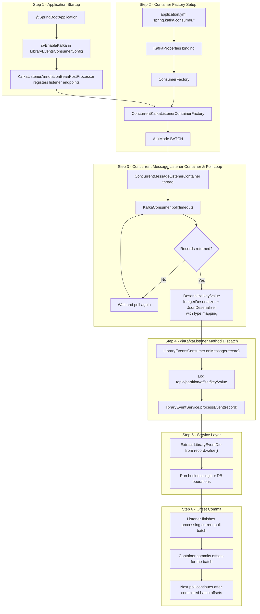
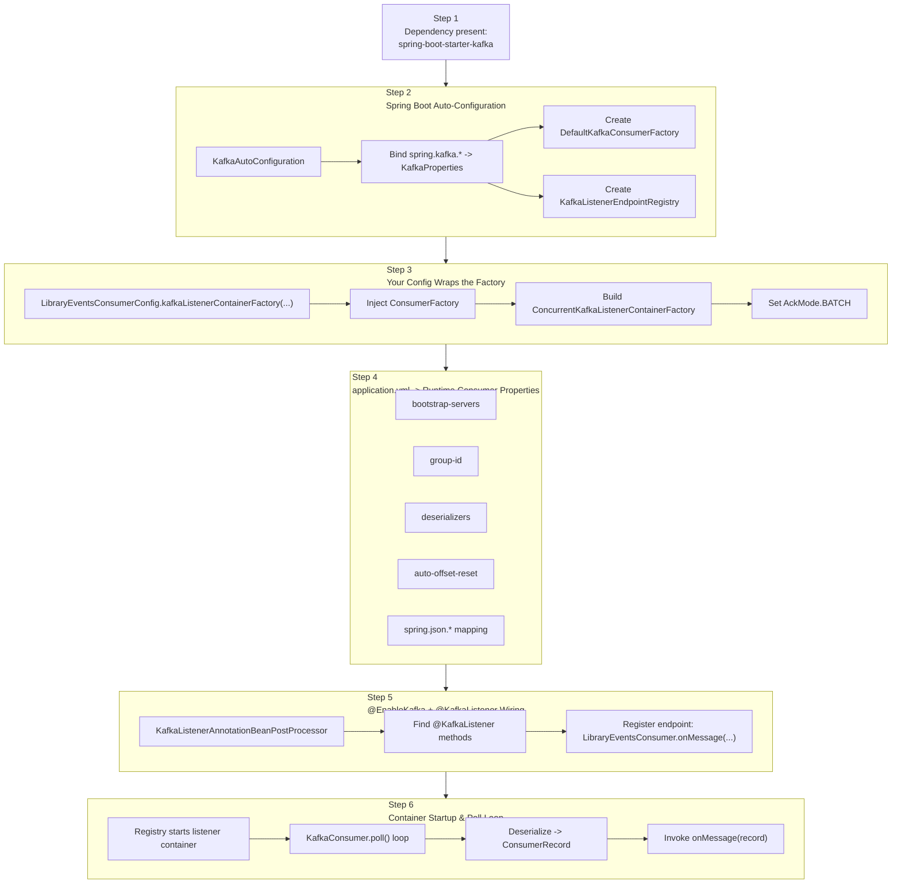

# Kafka Consumer Diagrams

## Table of Contents

- [Section 1: @KafkaListener Flow — How Records Are Polled](#section-1-kafkalistener-flow--how-records-are-polled)
  - [Step 1 — Application Startup](#step-1--application-startup)
  - [Step 2 — Container Factory Setup](#step-2--container-factory-setup)
  - [Step 3 — Concurrent Message Listener Container & Poll Loop](#step-3--concurrent-message-listener-container--poll-loop)
  - [Step 4 — @KafkaListener Method Dispatch](#step-4--kafkalistener-method-dispatch)
  - [Step 5 — Service Layer](#step-5--service-layer)
  - [Step 6 — Offset Commit](#step-6--offset-commit)
- [Section 2: Kafka Consumer Auto-Configuration Flow](#section-2-kafka-consumer-auto-configuration-flow)
  - [Step 1 — The trigger: spring-boot-starter-kafka](#step-1--the-trigger-spring-boot-starter-kafka)
  - [Step 2 — Auto-configuration class chain](#step-2--auto-configuration-class-chain)
  - [Step 3 — Your config overrides the factory](#step-3--your-config-overrides-the-factory)
  - [Step 4 — application.yml → KafkaProperties binding](#step-4--applicationyml--kafkaproperties-binding)
  - [Step 5 — @EnableKafka + @KafkaListener wiring](#step-5--enablekafka--kafkalistener-wiring)
  - [Step 6 — Complete auto-config picture](#step-6--complete-auto-config-picture)
  - [Key Takeaway](#key-takeaway)

---

## Section 1: @KafkaListener Flow — How Records Are Polled

### Step 1 — Application Startup

- Spring Boot starts the application context.
- `@EnableKafka` activates Kafka listener infrastructure.
- Spring scans beans and registers each `@KafkaListener` endpoint.

---

### Step 2 — Container Factory Setup

- Spring binds `spring.kafka.*` properties to `KafkaProperties`.
- `ConsumerFactory<Integer, LibraryEventDto>` is built from these settings.
- `ConcurrentKafkaListenerContainerFactory` wraps the consumer factory.
- This flow assumes `AckMode.BATCH`.

---

### Step 3 — Concurrent Message Listener Container & Poll Loop

- Listener container starts background polling threads.
- Each thread continuously calls `KafkaConsumer.poll(timeout)`.
- When records are present, Spring deserializes:
  - key -> `Integer`
  - value JSON -> `LibraryEventDto` via `JsonDeserializer`

---

### Step 4 — @KafkaListener Method Dispatch

- Spring invokes `LibraryEventsConsumer.onMessage(...)` per `ConsumerRecord`.
- The method logs metadata and delegates to `libraryEventService.processEvent(record)`.

---

### Step 5 — Service Layer

- Service reads `consumerRecord.value()` (already deserialized DTO).
- Business logic executes (mapping, validation, persistence, etc.).
- Keeping this in `@Service` keeps consumer code thin and testable.

---

### Step 6 — Offset Commit

- In BATCH ack mode, offsets are committed after the records returned from a `poll()` have been processed.
- The listener method does not need an `Acknowledgment` parameter for this flow.
- Next poll resumes from the latest committed batch offsets.

---

## Section 2: Kafka Consumer Auto-Configuration Flow

### Step 1 — The trigger: `spring-boot-starter-kafka`

- Adding `org.springframework.boot:spring-boot-starter-kafka` to `build.gradle` is the trigger.
- Spring Boot detects it on the classpath and enables Kafka auto-configuration.
- You do not manually create `KafkaConsumer` instances.

---

### Step 2 — Auto-configuration class chain

- Spring Boot registers `KafkaAutoConfiguration`.
- It binds `spring.kafka.*` into `KafkaProperties`.
- It creates:
  - `DefaultKafkaConsumerFactory<K,V>`
  - `KafkaListenerEndpointRegistry`
- The registry manages lifecycle (start/stop) of listener containers.

---

### Step 3 — Your config overrides the factory

- `LibraryEventsConsumerConfig` defines `kafkaListenerContainerFactory(...)`.
- Spring injects the auto-configured `ConsumerFactory<Integer, LibraryEventDto>`.
- You wrap it in `ConcurrentKafkaListenerContainerFactory` and apply project-specific settings (e.g., `AckMode.BATCH`).
- Kafka connection/deserializer settings still come from `application.yml`.

---

### Step 4 — `application.yml` → `KafkaProperties` binding

- Spring uses `@ConfigurationProperties(prefix = "spring.kafka")` to bind config.
- Key consumer fields include:
  - `bootstrap-servers`
  - `group-id`
  - `key-deserializer`
  - `value-deserializer`
  - `auto-offset-reset`
- Extended JSON options (`spring.json.*`) are passed through for `JsonDeserializer` behavior.

---

### Step 5 — `@EnableKafka` + `@KafkaListener` wiring

- `@EnableKafka` registers `KafkaListenerAnnotationBeanPostProcessor`.
- It scans beans for `@KafkaListener` methods.
- `LibraryEventsConsumer.onMessage(...)` is registered as a Kafka listener endpoint.
- The endpoint is associated with the configured container factory and topic.

---

### Step 6 — Complete auto-config picture

- `KafkaListenerEndpointRegistry` starts listener containers at runtime.
- Container threads run `KafkaConsumer.poll()` continuously.
- Records are deserialized into `ConsumerRecord<Integer, LibraryEventDto>`.
- Spring dispatches each record to `LibraryEventsConsumer.onMessage(...)`, and batch commits happen after the processed poll batch completes.

---

### Key Takeaway

You write **zero boilerplate** for the `KafkaConsumer` itself. Spring Boot auto-configuration:

| Step | What happens |
|------|-------------|
| 1 | `spring-boot-starter-kafka` on classpath triggers `KafkaAutoConfiguration` |
| 2 | `application.yml` is bound to `KafkaProperties` |
| 3 | `DefaultKafkaConsumerFactory` is created with all deserializer settings |
| 4 | Your `LibraryEventsConsumerConfig` wraps it in `ConcurrentKafkaListenerContainerFactory` |
| 5 | `@EnableKafka` scans for `@KafkaListener` and registers endpoints |
| 6 | `KafkaListenerEndpointRegistry` starts the poll loop in a background thread |
